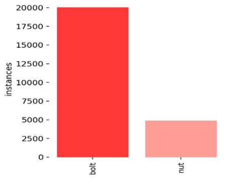
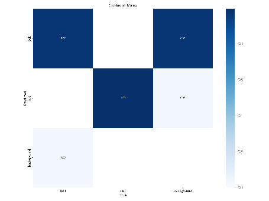
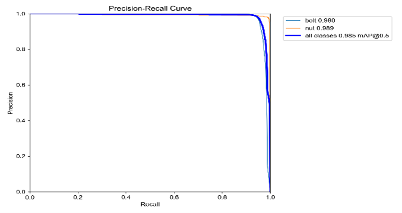
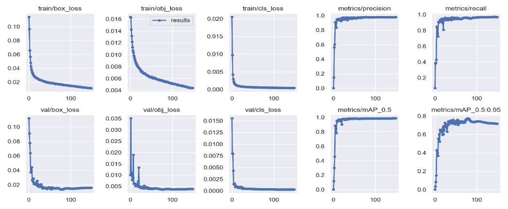

# Object Detection and Tracking

To test the code, first and foremost you need to add test video in challenge folder, then upload the weights of trained Yolov5m in the folder of runs/train/exp in yolov5.

# Data Distribution

# Training Graphs

  
  

# Detection and Tracking on Test Video

https://user-images.githubusercontent.com/53269317/216705219-1fe80083-357a-45ae-bb1f-bd6f015ca865.mp4

